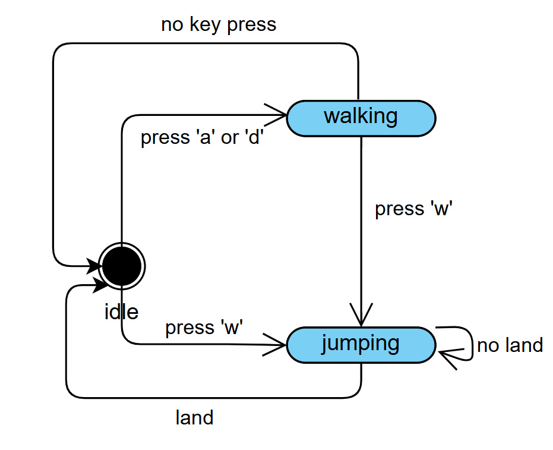

# FSM Character Movement with Pygame

This project demonstrates a simple finite state machine (FSM) for character movement using Pygame. The character can idle, walk, and jump based on the player's input, and the current state of the character is displayed on the screen in real time.

## Features

- **Idle:** The character stands still when no keys are pressed.
- **Walking:** The character moves left or right when the `A` or `D` keys are pressed.
- **Jumping:** The character jumps when the `W` key is pressed. Gravity brings the character back down to the floor.

The project uses sprite animations for the character in different states, and a text label shows the current state in the top right corner of the screen.

## Controls

- `A`: Move left
- `D`: Move right
- `W`: Jump

## State Transition Table

| Current State | Input      | Next State | Action                           |
| ------------- | ---------- | ---------- | -------------------------------- |
| Idle          | move_left  | Walking    | Character starts walking left    |
| Idle          | move_right | Walking    | Character starts walking right   |
| Idle          | jump       | Jumping    | Character jumps                  |
| Walking       | stop       | Idle       | Character stops walking          |
| Walking       | jump       | Jumping    | Character jumps                  |
| Jumping       | land       | Idle       | Character lands and stops moving |

### States Description

- **Idle:** The default state when no movement is occurring.
- **Walking:** Triggered by pressing `A` (move left) or `D` (move right).
- **Jumping:** Triggered by pressing `W` while in the idle or walking state. The character returns to the idle state when landing.

## Getting Started

### Prerequisites

Make sure you have Python 3.x and Pygame installed. You can install Pygame using:

```bash
pip install pygame
```

### Running

```
py main.py
```

## FSM Diagram

Here is a diagram illustrating the FSM transitions:


